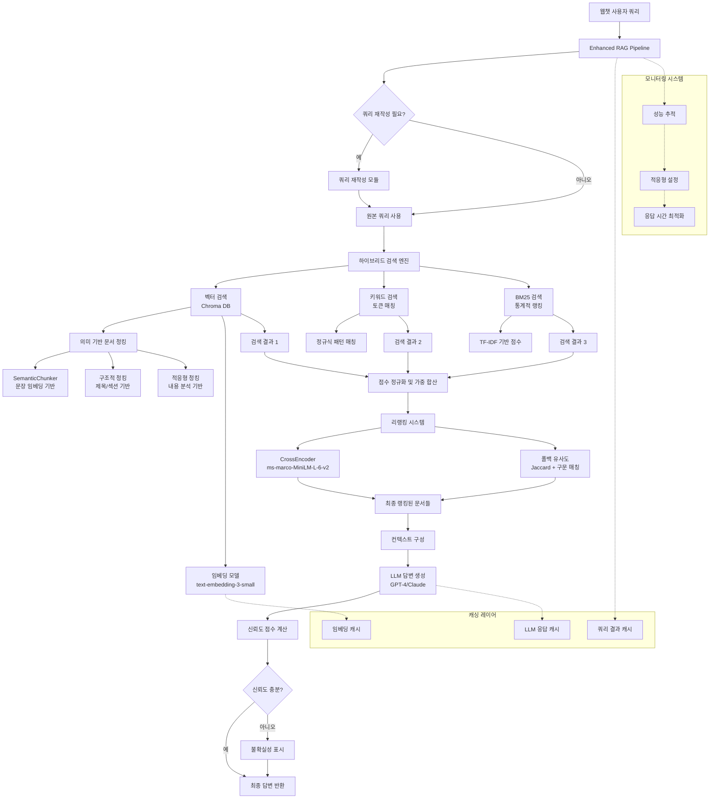

# RAG 시스템 아키텍처 및 핵심 로직 분석

## 시스템 개요

현재 구현된 RAG 시스템은 **고도로 발전된 하이브리드 검색 시스템**으로, 여러 계층의 검색 기법과 최적화 기술을 결합한 엔터프라이즈급 아키텍처입니다.

## 📋 시스템 구조 개요

### 핵심 모듈 구성

| 모듈 | 파일 | 역할 |
|------|------|------|
| **메인 파이프라인** | `enhanced_rag.py` | 통합 RAG 시스템 관리 |
| **하이브리드 검색** | `hybrid_search.py` | 3가지 검색 방식 결합 |
| **시맨틱 청킹** | `semantic_chunker.py` | 의미 기반 문서 분할 |
| **리랭킹** | `reranker.py` | 검색 결과 재정렬 |
| **문서 처리** | `document_processor.py` | 문서 전처리 및 메타데이터 |
| **임베딩** | `embeddings.py` | 벡터 임베딩 최적화 |

### 시스템 아키텍처 다이어그램



## 🔍 핵심 검색 알고리즘

### 1. 하이브리드 검색 엔진 (HybridSearchEngine)

```python
# 3가지 검색 방식의 가중 평균
최종점수 = (벡터검색점수 × 0.5) + (키워드검색점수 × 0.3) + (BM25점수 × 0.2)
```

**세부 구현:**
- **벡터 검색**: OpenAI `text-embedding-3-small` 모델 + Chroma DB
- **키워드 검색**: 정규식 기반 토큰 매칭 + TF-IDF
- **BM25 검색**: 통계적 문서 랭킹 (`k1=1.2, b=0.75`)

### 2. 의미 기반 청킹 시스템 (SemanticChunker)

**4가지 청킹 전략:**

1. **고정 크기 청킹**: 전통적인 방식 (청크 크기: 1500, 오버랩: 500)
2. **의미 기반 청킹**: 문장 임베딩 유사도 기반 그루핑
3. **구조적 청킹**: 마크다운 헤더, 리스트 구조 인식
4. **적응형 청킹**: 문서 내용에 따른 동적 전략 선택

**핵심 로직:**
```python
# 문장 유사도 기반 청킹
embeddings = sentence_transformer.encode(sentences)
similarity_matrix = cosine_similarity(embeddings)
chunks = group_by_similarity_threshold(sentences, similarity_matrix, threshold=0.6)
```

## 🎯 검색 프로세스 흐름

### 1. 쿼리 전처리 및 재작성
```python
async def rewrite_query(query: str) -> List[str]:
    # LLM을 활용한 쿼리 확장
    rewritten_queries = [
        original_query,
        synonym_expanded_query,
        domain_specific_query
    ]
    return rewritten_queries
```

### 2. 병렬 검색 실행
```python
# 여러 쿼리에 대해 동시 검색
parallel_results = await asyncio.gather(
    vector_search(query1), 
    vector_search(query2),
    vector_search(query3)
)
```

### 3. 점수 정규화 및 결합
```python
def combine_scores(vector_score, keyword_score, bm25_score):
    # 점수 정규화 (min-max scaling)
    normalized_scores = normalize([vector_score, keyword_score, bm25_score])
    
    # 가중 평균
    final_score = (
        normalized_scores[0] * 0.5 +  # 벡터 검색
        normalized_scores[1] * 0.3 +  # 키워드 검색  
        normalized_scores[2] * 0.2    # BM25
    )
    return final_score
```

## 🔄 리랭킹 시스템

### CrossEncoder 기반 재정렬
```python
# 교차 인코더를 통한 정밀 점수 계산
cross_encoder_scores = model.predict([(query, doc_text) for doc_text in documents])

# 원본 점수와 리랭킹 점수 결합
final_score = original_score * 0.3 + rerank_score * 0.7
```

**폴백 메커니즘:**
- CrossEncoder 실패 시 → Jaccard 유사도 + 구문 매칭
- 모델 로딩 실패 시 → 원본 점수 유지

## 📊 성능 최적화 기능

### 1. 다층 캐싱
- **쿼리 결과 캐싱**: 동일 쿼리 재사용
- **LLM 응답 캐싱**: 답변 생성 비용 절약
- **임베딩 캐싱**: 문서 벡터화 결과 저장

### 2. 지연 초기화 (Lazy Loading)
```python
def _initialize_vectorstore(self):
    if self._vectorstore_initialized:
        return
    # 실제 사용 시점에 초기화
    self.vectorstore = Chroma(...)
    self._vectorstore_initialized = True
```

### 3. 적응형 설정
- **동적 임계값 조정**: 검색 품질에 따른 자동 튜닝
- **성능 모니터링**: 응답 시간 추적 및 최적화
- **배치 처리**: 대량 문서 처리 시 병렬화

## 🎛️ 신뢰도 계산 시스템

```python
def calculate_confidence(answer, documents, search_metadata):
    # 검색 점수 기반 신뢰도
    search_confidence = min(max_search_score / score_threshold, 1.0)
    
    # 답변 길이 기반 보정
    length_factor = min(len(answer) / 200, 1.0)
    
    # 소스 다양성 고려
    source_diversity = len(unique_sources) / total_sources
    
    confidence = (search_confidence * 0.6 + 
                 length_factor * 0.2 + 
                 source_diversity * 0.2)
    
    return map_confidence_to_level(confidence)
```

## 🚀 실제 동작 파라미터

### 검색 설정
- **청크 크기**: 1500자 (컨텍스트 보존)
- **청크 오버랩**: 500자 (경계 정보 유지)
- **검색 문서 수**: 5개 (속도와 품질 균형)
- **점수 임계값**: 2.0 (한국어 지원 최적화)

### 하이브리드 가중치
- **벡터 검색**: 50% (의미적 유사도)
- **키워드 검색**: 30% (정확한 용어 매칭)
- **BM25**: 20% (통계적 관련성)

## 📈 주요 특징 및 장점

### 전통적인 RAG 대비 개선점
1. **다중 검색 전략**: 벡터, 키워드, BM25 결합으로 검색 정확도 향상
2. **의미 기반 청킹**: 문맥을 보존하는 지능적 문서 분할
3. **동적 쿼리 재작성**: LLM을 활용한 검색 쿼리 최적화
4. **리랭킹 시스템**: 교차 인코더를 통한 결과 품질 향상
5. **적응형 최적화**: 성능 모니터링 기반 자동 튜닝

### 한국어 지원 최적화
- **임계값 조정**: 한국어 특성을 고려한 점수 임계값 설정
- **토큰화 개선**: 한글 형태소 분석 지원
- **다국어 모델**: 한영 혼재 문서 처리 최적화

## 🔧 기술 스택

### 핵심 라이브러리
- **LangChain**: 문서 처리 및 체인 관리
- **ChromaDB**: 벡터 데이터베이스
- **OpenAI Embeddings**: 텍스트 임베딩
- **Sentence Transformers**: 문장 임베딩 및 CrossEncoder
- **NLTK**: 자연어 처리

### 성능 최적화
- **AsyncIO**: 비동기 처리로 응답 속도 향상
- **Redis Cache**: 결과 캐싱으로 중복 계산 방지
- **Batch Processing**: 대량 데이터 처리 최적화

이 시스템은 **전통적인 RAG의 한계를 극복**하고, **다중 검색 전략**과 **고도의 최적화 기법**을 통해 높은 정확도와 성능을 제공하는 엔터프라이즈급 솔루션입니다.
