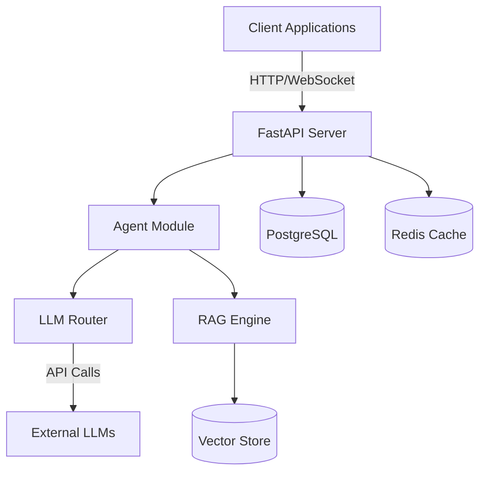
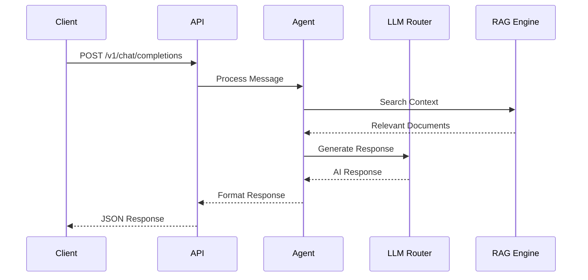

# MOJI AI Agent 아키텍처 설계

## 1. 시스템 개요

MOJI는 모놀리식 아키텍처로 시작하여 점진적으로 마이크로서비스로 전환 가능한 구조로 설계되었습니다.



## 2. 핵심 컴포넌트

### 2.1 API Layer
- **FastAPI Server**: RESTful API 제공
- **WebSocket Support**: 실시간 대화 지원
- **Authentication**: JWT 기반 인증

### 2.2 Agent Module
- **Single Agent**: MVP에서는 단일 에이전트로 시작
- **Context Management**: 대화 컨텍스트 유지
- **Intent Processing**: 사용자 의도 파악

### 2.3 LLM Router
- **Provider Abstraction**: 다양한 LLM 프로바이더 지원
- **Default Model**: DeepSeek R1
- **Environment Config**: 환경 변수로 모델 변경

### 2.4 RAG Engine
- **Document Processing**: 텍스트 파일 처리
- **Vector Search**: 유사도 기반 검색
- **Context Injection**: 검색 결과를 프롬프트에 주입

## 3. 데이터 플로우



## 4. 디렉토리 구조

```
app/
├── api/
│   └── v1/
│       ├── __init__.py
│       ├── chat.py        # Chat endpoints
│       ├── health.py      # Health check
│       └── auth.py        # Authentication
├── core/
│   ├── __init__.py
│   ├── config.py          # Settings management
│   ├── security.py        # JWT handling
│   └── exceptions.py      # Custom exceptions
├── models/
│   ├── __init__.py
│   ├── chat.py           # Chat models
│   ├── auth.py           # Auth models
│   └── common.py         # Common models
├── services/
│   ├── __init__.py
│   ├── agent.py          # Agent logic
│   ├── llm_router.py     # LLM routing
│   └── rag.py            # RAG service
└── db/
    ├── __init__.py
    └── session.py        # Database session
```

## 5. 확장성 고려사항

### 5.1 모듈화
- 각 서비스는 독립적인 모듈로 구성
- 향후 마이크로서비스 분리 용이

### 5.2 인터페이스 추상화
- LLM Provider 인터페이스
- Storage 인터페이스
- Platform Adapter 인터페이스

### 5.3 설정 관리
- 환경 변수 기반 설정
- 환경별 설정 분리 (dev/staging/prod)

## 6. 성능 목표 (MVP)

- **응답 시간**: < 5초
- **동시 사용자**: 10명
- **메모리 사용**: < 2GB
- **CPU 사용률**: < 50%

## 7. 보안 고려사항

- JWT 기반 인증
- API Key 관리
- Rate Limiting
- CORS 설정
- HTTPS 강제