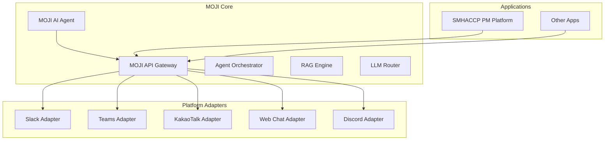

# MOJI AI Agent & SMHACCP 프로젝트 관리 플랫폼 - 제품 개발 설계서 (PRD) v3.0

> **비전**: 독립적이고 확장 가능한 AI Agent **MOJI**를 개발하여 다양한 플랫폼에서 활용하고, 이를 기반으로 SMHACCP 전용 프로젝트 관리 플랫폼을 구축

---

## 1. 프로젝트 개요

### 1.1 프로젝트 구성
본 프로젝트는 두 개의 독립적인 서브 프로젝트로 구성됨:

#### Phase 1: MOJI AI Agent (우선순위)
- **프로젝트명**: MOJI - Multi-Platform AI Assistant
- **개발 기간**: 8주
- **목표**: 플랫폼 독립적인 대화형 AI Agent 개발
- **핵심 가치**: 다양한 메신저와 플랫폼에서 활용 가능한 범용 AI 어시스턴트

#### Phase 2: SMHACCP 프로젝트 관리 플랫폼
- **프로젝트명**: SMHACCP Project Manager
- **개발 기간**: 6주
- **목표**: MOJI를 통합한 지능형 프로젝트 관리 시스템
- **핵심 가치**: AI 기반 업무 자동화 및 데이터 통합 관리

### 1.2 전체 아키텍처 비전


---

## 2. Phase 1: MOJI AI Agent 개발

### 2.1 핵심 기능

#### 2.1.1 Multi-Platform 지원
- **어댑터 패턴** 기반 플랫폼별 인터페이스
- 지원 플랫폼:
  - Slack
  - Microsoft Teams
  - KakaoTalk (채널톡 API)
  - Discord
  - Web Chat Widget
  - REST API (커스텀 통합용)

#### 2.1.2 지능형 대화 엔진
- **LangGraph** 기반 복잡한 대화 플로우 관리
- **Multi-Agent 시스템**:
  - Router Agent: 의도 파악 및 적절한 전문 Agent 라우팅
  - Task Agent: 업무 관련 질의 처리
  - Knowledge Agent: RAG 기반 지식 검색
  - Action Agent: 외부 시스템 연동 및 실행
- **컨텍스트 관리**: 대화 이력 및 사용자 프로파일 기반 개인화

#### 2.1.3 RAG (Retrieval-Augmented Generation)
- **LangChain** 기반 문서 처리 파이프라인
- **Vector Store**: Chroma DB + Weaviate 하이브리드
- **임베딩 모델**: 
  - 한국어: KLUE-RoBERTa
  - 영어: text-embedding-3-small
- **검색 전략**:
  - Semantic Search
  - Hybrid Search (BM25 + Vector)
  - MMR (Maximum Marginal Relevance)

#### 2.1.4 LLM 라우팅 및 모델 관리
```python
class LLMRouter:
    """동적 LLM 선택 및 폴백 처리"""
    models = {
        "primary": "gpt-4o",
        "fallback": "exaone-3.5-7b",
        "fast": "qwen2.5-3b",
        "code": "deepseek-coder-v2"
    }
    
    def route(self, query_type, context):
        # 쿼리 타입과 컨텍스트에 따른 최적 모델 선택
        pass
```

#### 2.1.5 플러그인 시스템
- **동적 기능 확장**: 런타임 플러그인 로드
- **기본 플러그인**:
  - Calendar Integration
  - Task Management
  - Document Search
  - Code Execution (Sandboxed)
  - Data Analysis

### 2.2 기술 스택

#### 2.2.1 Core Backend
```yaml
Language: Python 3.11+
Framework: FastAPI 0.111
AI/ML:
  - LangChain 0.2.x
  - LangGraph 0.1.x
  - LangServe
  - PyTorch 2.0+ (임베딩 모델)
  
Database:
  - PostgreSQL 15 (메타데이터)
  - Redis 7 (캐시/세션)
  - Chroma DB (벡터 스토어)
  
Message Queue: 
  - Celery + Redis
  - Apache Kafka (이벤트 스트리밍)
```

#### 2.2.2 인프라
```yaml
Container:
  - Docker + Docker Compose
  - Kubernetes (Production)
  
Observability:
  - OpenTelemetry
  - Prometheus + Grafana
  - Elastic APM
  
CI/CD:
  - GitHub Actions
  - ArgoCD
  - Helm Charts
```

### 2.3 API 설계

#### 2.3.1 Core API Endpoints
```yaml
# Chat API
POST   /v1/chat/completions
POST   /v1/chat/streaming
GET    /v1/chat/history/{session_id}

# Agent API  
POST   /v1/agents/invoke
GET    /v1/agents/list
POST   /v1/agents/create

# Plugin API
GET    /v1/plugins/available
POST   /v1/plugins/install
POST   /v1/plugins/{plugin_id}/execute

# Platform Webhooks
POST   /v1/webhooks/slack
POST   /v1/webhooks/teams
POST   /v1/webhooks/kakao
```

#### 2.3.2 SDK 제공
```python
# Python SDK Example
from moji import MojiClient

client = MojiClient(api_key="...")
response = client.chat.create(
    messages=[{"role": "user", "content": "안녕하세요"}],
    platform="slack",
    user_id="U123456"
)
```

### 2.4 보안 및 규정 준수

#### 2.4.1 인증/인가
- **OAuth 2.0** + **JWT** 기반 인증
- **API Key** 관리 (Rate Limiting 포함)
- **Platform별 인증** 통합 (Slack OAuth, Teams SSO 등)

#### 2.4.2 데이터 보안
- **E2E 암호화** (민감 정보)
- **PII 마스킹** 및 익명화
- **감사 로그** (Audit Trail)
- **GDPR/개인정보보호법** 준수

### 2.5 개발 로드맵 (8주)

| 주차 | 목표 | 주요 산출물 |
|-----|------|------------|
| 1-2 | 아키텍처 설계 및 기반 구축 | - API 스펙 확정<br>- Docker 환경 구성<br>- 기본 FastAPI 서버 |
| 3-4 | Core Agent 개발 | - LangGraph 기반 Agent<br>- 기본 대화 플로우<br>- LLM 라우터 구현 |
| 5-6 | RAG 시스템 구축 | - 문서 처리 파이프라인<br>- Vector Store 구축<br>- 검색 최적화 |
| 7 | Platform Adapter 개발 | - Slack/Teams 어댑터<br>- Webhook 처리<br>- 인증 통합 |
| 8 | 테스트 및 배포 | - 통합 테스트<br>- 성능 최적화<br>- K8s 배포 |

---

## 3. Phase 2: SMHACCP 프로젝트 관리 플랫폼

### 3.1 핵심 기능

#### 3.1.1 MOJI 통합
- MOJI API를 활용한 자연어 인터페이스
- 프로젝트별 커스텀 Knowledge Base
- 업무 자동화 워크플로우

#### 3.1.2 프로젝트 관리
- Monday.com 양방향 동기화
- 간트 차트 및 칸반 보드
- 리소스 관리 및 워크로드 분석

#### 3.1.3 통합 대시보드
- 실시간 프로젝트 현황
- KPI 모니터링
- 예측 분석 (ML 기반)

#### 3.1.4 문서 관리
- OneDrive/Google Drive 통합
- AI 기반 문서 분류 및 태깅
- 지능형 검색

### 3.2 기술 스택

#### 3.2.1 Frontend
```yaml
Framework: Next.js 14
Language: TypeScript 5
UI: 
  - Tailwind CSS 3
  - Shadcn/ui
  - Framer Motion
State: 
  - Zustand
  - React Query v5
Charts: 
  - Recharts
  - D3.js
```

#### 3.2.2 Backend Integration
- MOJI API 클라이언트
- Monday.com GraphQL API
- Microsoft Graph API
- Google Workspace API

### 3.3 개발 로드맵 (6주)

| 주차 | 목표 | 주요 산출물 |
|-----|------|------------|
| 1 | UI/UX 설계 | Figma 디자인, 컴포넌트 시스템 |
| 2-3 | Frontend 개발 | 기본 레이아웃, 라우팅, 인증 |
| 4 | MOJI 통합 | 챗 인터페이스, API 연동 |
| 5 | 외부 서비스 연동 | Monday.com, Drive 동기화 |
| 6 | 테스트 및 배포 | E2E 테스트, 프로덕션 배포 |

---

## 4. 성공 지표 (KPI)

### 4.1 MOJI AI Agent
- **응답 정확도**: 90% 이상
- **응답 시간**: 평균 2초 이내
- **동시 사용자**: 1,000명 이상 지원
- **플랫폼 가용성**: 99.9% SLA
- **플러그인 생태계**: 출시 후 3개월 내 10개 이상

### 4.2 프로젝트 관리 플랫폼
- **사용자 채택률**: 전직원 80% 이상
- **업무 효율성**: 관리 시간 50% 감소
- **MOJI 활용도**: 일 평균 200건 이상 질의
- **사용자 만족도**: NPS 40 이상

---

## 5. 리스크 관리

### 5.1 기술적 리스크
| 리스크 | 영향도 | 대응 방안 |
|--------|--------|-----------|
| LLM 비용 상승 | 높음 | 자체 모델 fine-tuning, 캐싱 전략 |
| 플랫폼 API 변경 | 중간 | 어댑터 패턴으로 격리, 버전 관리 |
| 성능 병목 | 높음 | 로드 밸런싱, 비동기 처리 |

### 5.2 비즈니스 리스크
| 리스크 | 영향도 | 대응 방안 |
|--------|--------|-----------|
| 사용자 저항 | 중간 | 단계적 도입, 교육 프로그램 |
| 데이터 보안 우려 | 높음 | 투명한 보안 정책, 감사 기능 |
| ROI 불확실성 | 중간 | MVP 통한 빠른 검증, 지표 기반 개선 |

---

## 6. 확장 계획

### 6.1 MOJI 생태계 확장
- **마켓플레이스**: 써드파티 플러그인 지원
- **Fine-tuning 서비스**: 기업별 맞춤 모델
- **분석 대시보드**: MOJI 사용 패턴 분석

### 6.2 추가 통합 대상
- SAP ERP
- Jira/Confluence


---

## 7. 결론

MOJI를 독립적인 AI Agent로 개발하여 확장성과 재사용성을 확보하고, 이를 기반으로 SMHACCP 전용 프로젝트 관리 플랫폼을 구축함으로써:

1. **기술 자산 확보**: 범용 AI Agent 플랫폼 보유
2. **빠른 ROI 실현**: MOJI를 다양한 채널에서 즉시 활용
3. **확장 가능성**: 타 기업/서비스로의 확장 기회
4. **경쟁력 강화**: AI 기반 업무 자동화로 생산성 향상

단계적 접근을 통해 리스크를 최소화하면서도 혁신적인 가치를 창출할 수 있을 것으로 기대함.